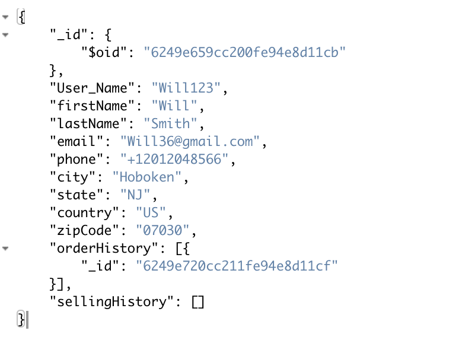
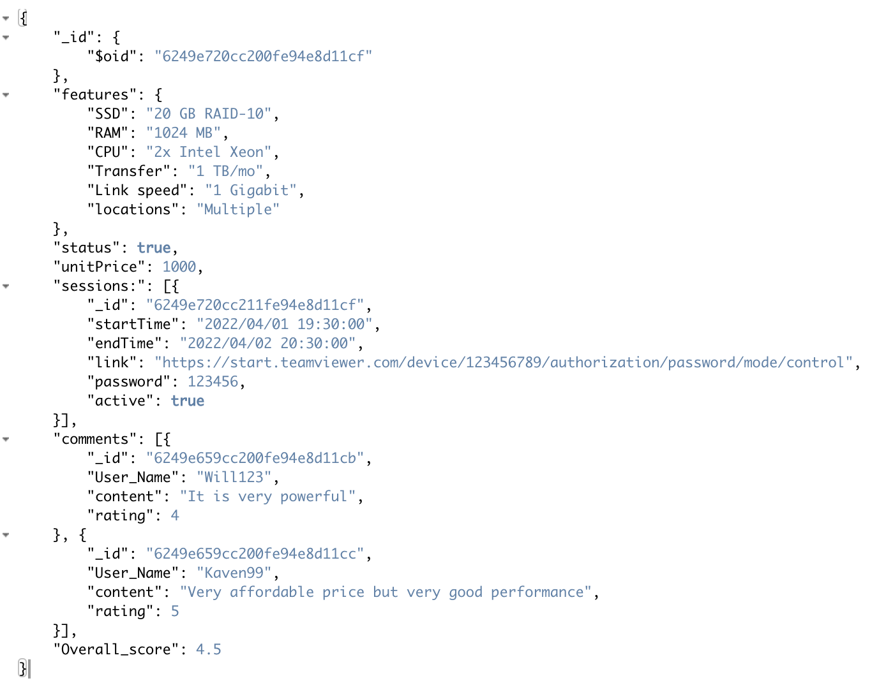

## Team Member:  
Zongshuo Wei  20005210  
Chengchen Zhao 10468151  
Lingrui Li 10478741  
Jiyuan Xia 10468319  
Hanyu Wang 10474507 

## Users:  
  
The user collection contains all the registered users and their corresponding data. Each document is constructed with userid, user name, first name, last name, email address, phone number, residential city, residential state, country, zipcode and the id correspondes to the purchase and selll collections that contain data about their purchase history and selling history.  
  
  
  

  
| Name        | Type  |  Description   |
| ------------| ------------- |  -----------|
| _id  | string | A globally unique identifier to represent the user  |
| userName  | string | User name of the user account |
| password  | string | Password of the user account |
| firstName  | string | First name of the user  |
| lastName  | string | Last name of the user |
| email  | string | Email of the user |
| phone  | string |  Phone number of the user |
| city  | string | City of the user |
| state  | string | State of the user |
| country  | string |  Country of the user |
| zipCode  | string | Zip code of the user |
| orderHistory  | array | An array that stores all the sessions id bought by the user |
| sellingHistory  | array |  An array that stores all the sessions id listed by the user |
  
  
## Product:
  
The product collection contains all the information about listed product postings. Each product contains product id, feature description as subdocument, active status,unit price, and their corresponding sessions and comments as subdocuments. The session subdocument contains session id, starting time, ending time, access link, password, and active status. The comments subdocument contains comment id, user name, comment content, and rating score. An overall rating will be calculated based on each comment rating.
  
  
  

| Name        | Type  |  Description   |
| ------------| ------------- |  -----------|
| _id  | string | A globally unique identifier to represent the product |
| features  | object | An object that stores all the parameters of the product |
| status  | boolean | Statue of the product true -- on sale/ false -- removed |
| unitPrice  | number | Unit price of the product |
| sessions  | array |  An array that stores all the session records |
| comments  | array |   An array that stores all the comments listed by users |
| overallRating  | number | Overall rating of the product |

## features:

| Name        | Type  |  Description   |
| ------------| ------------- |  -----------|
| SSD  | string | product parameter |
| RAM  | string | product parameter |
| CPU  | string | product parameter |
| Transfer  | string | product parameter |
| Link speed  | string | product parameter |
| locations  | string | product parameter |

## Sessions:

| Name        | Type  |  Description   |
| ------------| ------------- |  -----------|
| _id  | string | A globally unique identifier to represent the session |
| startTime  | string | Start time of the session |
| endTime  | string | End time of the session  |
| link  | string | Link of the session |
| password  | string |  Password of the session |
| active  | boolean |  Active status of the session |

## Comments:

| Name        | Type  |  Description   |
| ------------| ------------- |  -----------|
| _id  | string | A globally unique identifier to represent the comment |
| User_Name  | string | User name of the user who make the comment |
| content  | string | Content of the comment  |
| rating  | number | Rating that user provides |

